# High-Level Design — mic-array / ePCR Extraction Pipeline

---

## 1. System Architecture

Two cooperating processes: `doa_transcribe.py` captures and transcribes audio from the ReSpeaker hardware; `ai_client.py` receives transcript batches, accumulates per-session context, and drives LLM-based ePCR field extraction.

```mermaid
graph LR
    subgraph Hardware
        HW["ReSpeaker 4 Mic Array\nUSB 2886:0018 · XMOS XVF3000\n6-ch UAC1.0 · onboard AEC+NS+DOA"]
    end

    subgraph doa_transcribe.py
        direction TB
        AUDIO["PortAudio callback\n50 ms float32 blocks\nch4 AEC+NS mono"]
        DOA_POLL["DoaPoller\n100 ms USB ctrl_transfer\nPARAM_DOA_ANGLE = 21"]
        SEG["SegmentManager\n30 ms VAD frames\nwebrtcvad aggressiveness 0-3"]
        TRACKER["SpeakerTracker\nDOA zone resolver\nauto-discovery"]
        TXQUEUE["tx_queue\nQueue[TranscriptionItem]"]
        WORKER["_transcription_worker\nWhisper ASR\nquality gate · forward"]
    end

    subgraph ai_client.py
        direction TB
        FLASK["Flask HTTP server\nPOST /api/ingest\nGET  /api/session/:id\nGET  /health"]
        SESSIONS["sessions: Dict[str, Session]\nper-session utterance buffer\nfield state machine"]
        EXTRACTOR["extraction_loop\ndaemon thread\ndebounce timer"]
        LLM["LLMClient\nAnthropic · Perplexity · Cohere\nOpenAI-compat or native SDK"]
    end

    subgraph Outputs
        JSONL[("transcripts.jsonl\nappend-only")]
        PCR[("<session>_epcr.json\noverwritten each pass")]
        PROVIDER["LLM API\nAnthropic / Perplexity / Cohere"]
    end

    subgraph Tests
        REPLAY["tests/test_replay.py\nHTTP replay of\nJSON conversation files"]
    end

    HW -- "6ch 16kHz PCM\nsounddevice InputStream" --> AUDIO
    HW -- "USB vendor ctrl\nread 8 bytes → int32 LE" --> DOA_POLL
    AUDIO --> SEG
    DOA_POLL -- "doa.angle\nread under lock" --> SEG
    SEG --> TRACKER
    TRACKER --> SEG
    SEG -- "put(zone, audio, t)" --> TXQUEUE
    TXQUEUE -- "blocking get" --> WORKER
    WORKER -- "transcript_batch JSON" --> JSONL
    WORKER -- "HTTP POST" --> FLASK
    REPLAY -- "HTTP POST" --> FLASK
    FLASK --> SESSIONS
    SESSIONS --> EXTRACTOR
    EXTRACTOR --> LLM
    LLM --> PROVIDER
    PROVIDER --> LLM
    LLM --> EXTRACTOR
    EXTRACTOR --> PCR
```

---

## 2. `doa_transcribe.py` — Thread Model

Four concurrent execution contexts:

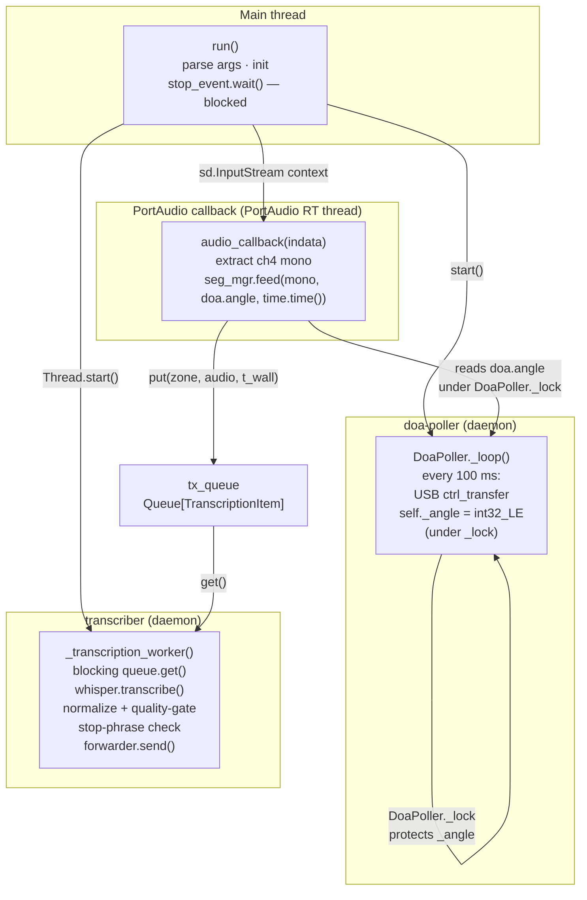

### 2.1 Audio Pipeline Sequence

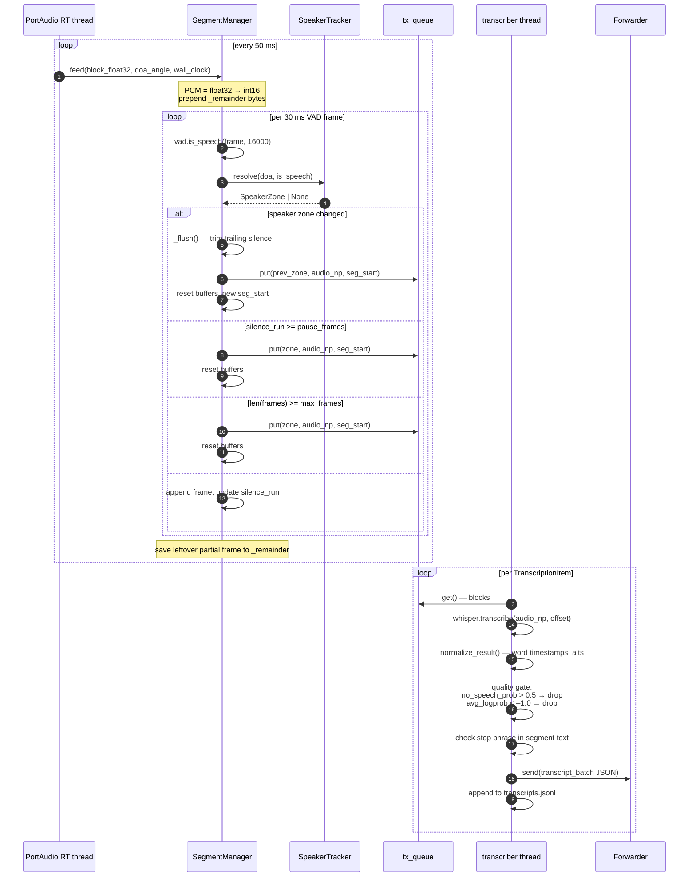

### 2.2 Speaker Zone Resolution — SpeakerTracker

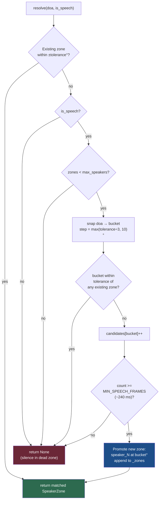

### 2.3 Segment Flush Logic

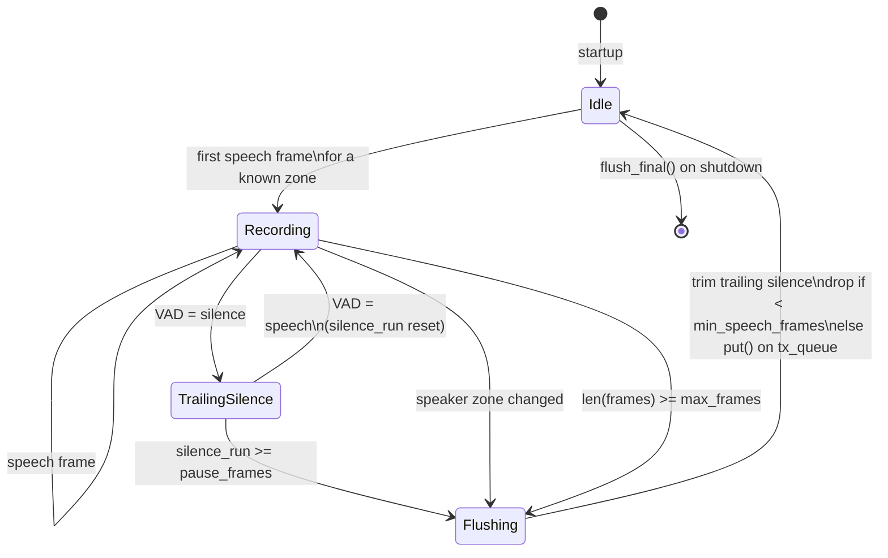

### 2.4 Lock Table — `doa_transcribe.py`

| Primitive | Type | Writer | Reader(s) | Protects |
|---|---|---|---|---|
| `DoaPoller._lock` | `threading.Lock` | doa-poller thread | PortAudio callback (via `doa.angle` property) | `_angle: int` |
| `SpeakerTracker._lock` | `threading.Lock` | PortAudio callback (auto-promote path) | PortAudio callback (resolve path) | `_zones`, `_candidates` |
| `tx_queue` | `queue.Queue` | PortAudio callback (`put`) | transcriber thread (`get`) | `TranscriptionItem` objects |
| `stop_event` | `threading.Event` | transcriber (stop phrase), signal handler | Main thread (`wait`) | shutdown signal |

`SegmentManager` has no lock — it is only ever touched from the PortAudio callback thread.

---

## 3. `ai_client.py` — Thread Model

Three execution contexts: Flask's built-in werkzeug server (one thread per request), the `extractor` daemon thread, and the main thread (which runs `app.run()` and blocks).

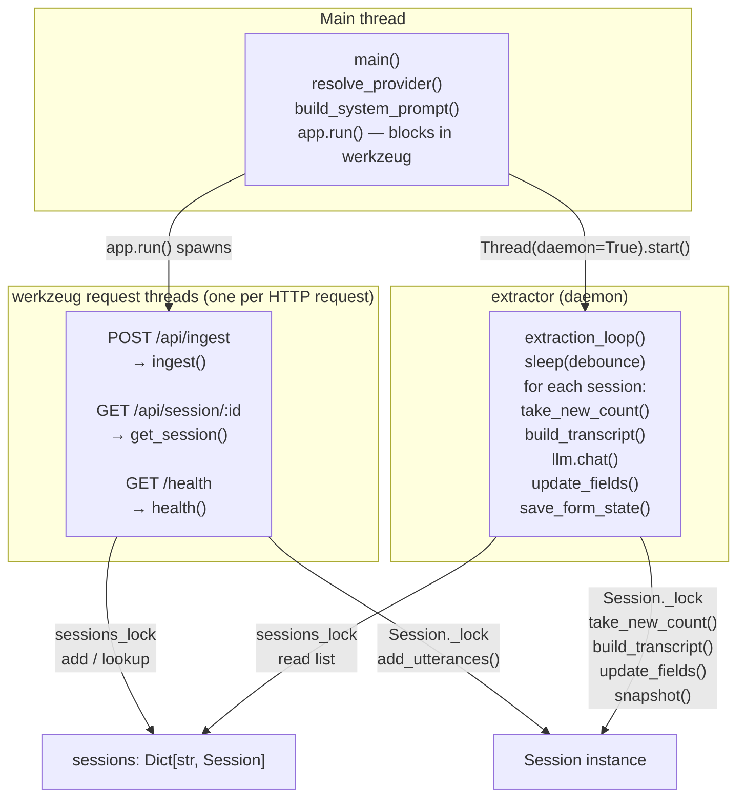

### 3.1 Extraction Loop Sequence

```mermaid
sequenceDiagram
    autonumber
    participant WZ as werkzeug thread
    participant SL as sessions_lock
    participant S as Session._lock
    participant EXT as extractor thread
    participant LLM as LLMClient

    Note over WZ: POST /api/ingest arrives
    WZ->>SL: acquire
    WZ->>SL: lookup / create Session
    WZ->>SL: release
    WZ->>S: acquire
    WZ->>S: append utterances; new_since_last_extraction++
    WZ->>S: release
    WZ-->>WZ: return {"ok": true}

    loop every debounce seconds (default 4s)
        EXT->>SL: acquire → snapshot list(sessions.values())
        EXT->>SL: release
        loop per session
            EXT->>S: acquire → take_new_count(); release
            alt new_count == 0
                Note over EXT: skip — no new utterances
            else
                EXT->>S: acquire → build_transcript(); release
                EXT->>LLM: chat(system_prompt, transcript_text)
                Note over LLM: API call — may take 5–30s
                LLM-->>EXT: raw JSON string
                EXT->>EXT: strip markdown fences; json.loads()
                EXT->>S: acquire → update_fields(extracted)<br/>merge speaker_roles; release
                EXT->>EXT: print changed fields to stdout
                EXT->>EXT: save_form_state() → <session>_epcr.json
            end
        end
    end
```

### 3.2 Session Field State Machine

Each field in `Session.fields` transitions independently:

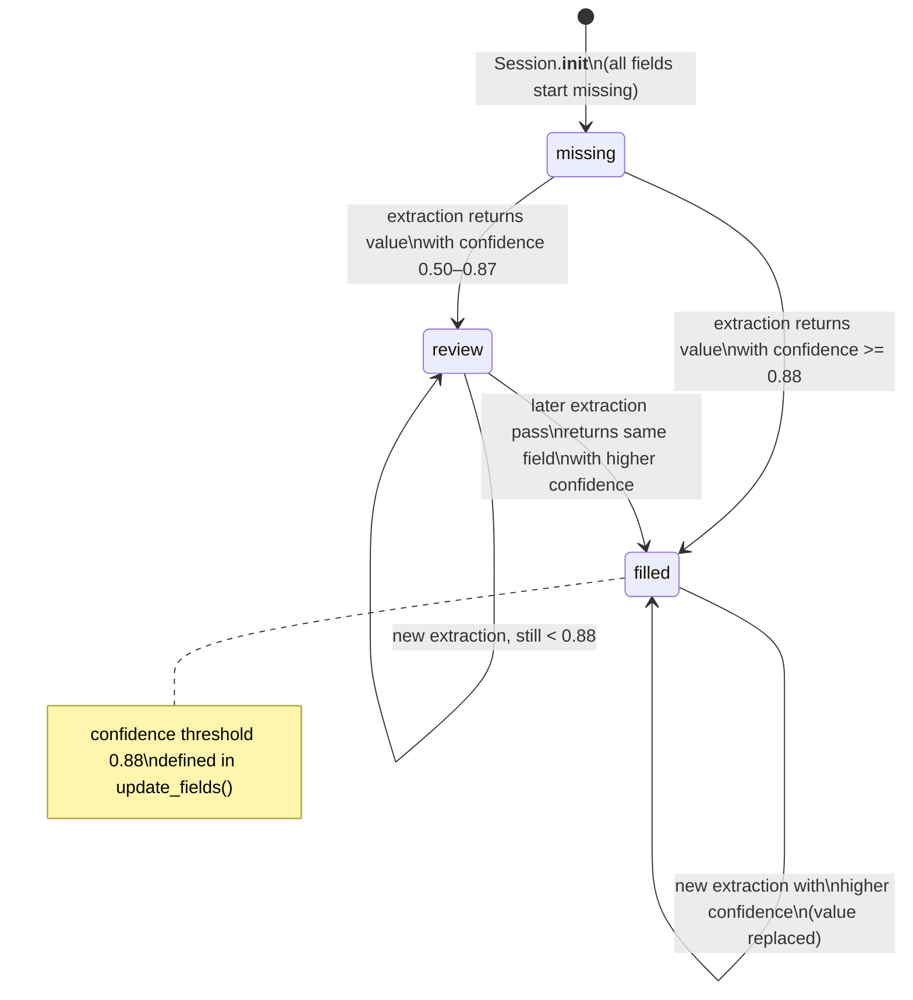

### 3.3 Lock Table — `ai_client.py`

| Primitive | Type | Writer threads | Reader threads | Protects |
|---|---|---|---|---|
| `sessions_lock` | `threading.Lock` | werkzeug (new session creation) | werkzeug (lookup), extractor (list copy), health | `sessions: Dict[str, Session]` |
| `Session._lock` | `threading.Lock` | werkzeug (`add_utterances`), extractor (`update_fields`, `speaker_roles`) | extractor (`build_transcript`, `take_new_count`, `snapshot`, `_metrics_locked`) | `utterances`, `fields`, `new_since_last_extraction`, `speaker_roles` |

> Note: `extraction_loop` acquires `Session._lock` directly via `session._lock` when merging `speaker_roles` — intentional re-entry of the same lock the session already owns via helper methods.

---

## 4. End-to-End Data Flow

```mermaid
flowchart LR
    subgraph ReSpeaker["ReSpeaker 4 Mic Array"]
        MIC_CH["ch4: 16kHz mono\nAEC + noise suppression\n(XMOS XVF3000)"]
        DOA_CHIP["DOA angle: 0–359°\nUSB vendor ctrl\nParam 21, 8 bytes, int32 LE"]
    end

    subgraph doa_t["doa_transcribe.py"]
        FRAME["30 ms PCM frame\nint16 bytes"]
        VAD_OUT["is_speech: bool\nwebrtcvad"]
        ZONE_OUT["SpeakerZone\nrole + center°"]
        SEG_OUT["audio segment\nfloat32 numpy array\n+ wall-clock start"]
        ASR_OUT["segments[]\ntext · confidence\nword timestamps\navg_logprob · no_speech_prob"]
        PAYLOAD["transcript_batch JSON\nsession_id · speaker_role\ncaptured_at · language\nsegments[]"]
    end

    subgraph ai_t["ai_client.py"]
        UTT["utterances[]\n{time, speaker, text, confidence}"]
        TRANSCRIPT["plain-text transcript\n[HH:MM:SS] speaker: text"]
        LLM_RESP["LLM JSON response\nfields{} · speaker_roles{}\nfollow_up_needed[] · notes"]
        FIELDS["fields{}\nvalue · confidence\nevidence · status\nlast_updated"]
    end

    MIC_CH -->|"sounddevice\n50ms blocks"| FRAME
    DOA_CHIP -->|"every 100ms"| ZONE_OUT
    FRAME --> VAD_OUT
    VAD_OUT --> ZONE_OUT
    ZONE_OUT --> SEG_OUT
    SEG_OUT -->|"Whisper\nwhisper-timestamped"| ASR_OUT
    ASR_OUT -->|"quality gate\nno_speech_prob · avg_logprob"| PAYLOAD
    PAYLOAD -->|"HTTP POST\n/api/ingest"| UTT
    UTT -->|"build_transcript()"| TRANSCRIPT
    TRANSCRIPT -->|"llm.chat(system_prompt, user_msg)"| LLM_RESP
    LLM_RESP -->|"update_fields()\nconfidence threshold 0.88"| FIELDS
    FIELDS -->|"snapshot()"| PCR2[("<session>_epcr.json")]
```

---

## 5. LLM Provider Abstraction

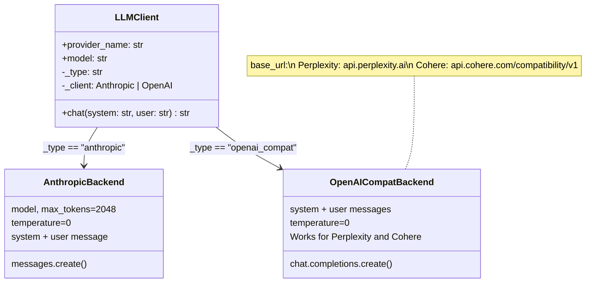

Provider selection at startup:

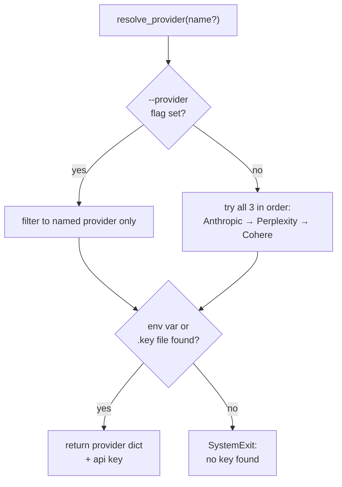

---

## 6. `schemas/epcr.yaml` — Field Sources and Unlock Logic

Fields are tagged by `source` to control what the LLM is asked to extract:

| Source | Extracted by LLM | Description |
|---|---|---|
| `conversation` | Yes | Spoken by patient or paramedic |
| `paramedic` | Yes | Observed or documented aloud by paramedic |
| `vitals` | No | Measured values, entered manually |
| `scan` | No | Health card / licence scanner |
| `derived` | No | Computed from other fields |

Optional fields with `unlock_keywords` are included in the system prompt only when at least one keyword appears in the transcript (e.g., `cardiac_arrest` fields unlock on "collapsed", "CPR", "no pulse"). This keeps the prompt lean for routine calls and expands it automatically for high-acuity events.

Field confidence thresholds in `update_fields()`:

```
confidence >= 0.88  →  status: "filled"   (accepted, displayed with +)
0.50 <= conf < 0.88 →  status: "review"   (flagged, displayed with ~)
conf < 0.50         →  not included by LLM (prompt instructs < 0.5: omit)
```

---

## 7. HTTP API

All endpoints are on `ai_client.py` (default port 8080):

| Method | Path | Description |
|---|---|---|
| `POST` | `/api/ingest` | Receive a `transcript_batch` JSON payload; create session on first call |
| `GET` | `/api/session/:id` | Return full session snapshot: utterances, fields, metrics |
| `GET` | `/health` | Liveness check; returns `{"status":"ok","sessions":N}` |

### `POST /api/ingest` payload

```json
{
  "session_id":   "session-001",
  "speaker_role": "paramedic",
  "captured_at":  1750000000.0,
  "language":     "en",
  "language_changed": false,
  "segments": [
    {
      "segment_id":   0,
      "start":        0.0,
      "end":          3.4,
      "text":         "What brings you in today?",
      "confidence":   0.97,
      "alternatives": [],
      "words": [
        {"text": "What", "start": 0.0, "end": 0.2, "confidence": 0.99}
      ]
    }
  ]
}
```

---

## 8. Test Harness

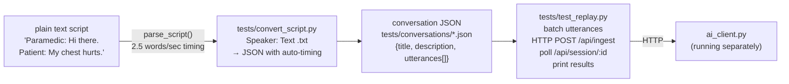

`convert_script.py` estimates utterance timing from word count at 2.5 words/second with a 1-second gap between turns. Explicit `--map DISPLAY:ROLE` overrides auto-generated role IDs (`"Paramedic 1"` → `paramedic_1`).
